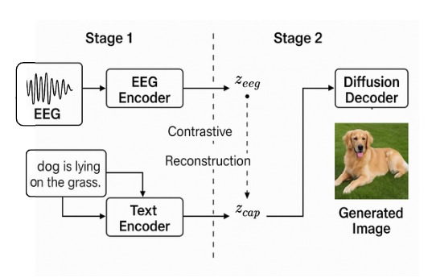
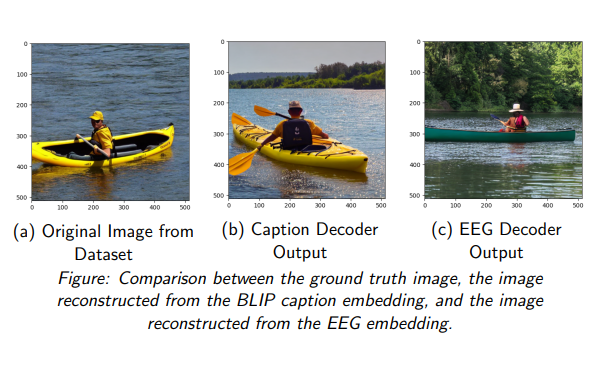

# Cognitron: Thoughts from EEG via Caption-Guided Latent Alignment

Cognitron is a deep learning framework for decoding visual content from EEG signals using a caption-guided alignment strategy. It is designed to bridge the gap between noisy, low-spatial-resolution EEG data and complex image synthesis by leveraging natural-language captions as an intermediate semantic space.

## Project Motivation

Decoding visual information from neural signals is a key challenge in neuroscience, brain-computer interfaces (BCIs), and assistive technologies. While fMRI provides high spatial resolution, it suffers from low temporal resolution and high cost. In contrast, EEG is portable, low-cost, and has high temporal resolution, making it more suitable for real-time applications, despite its noisy and low spatial resolution nature. This project aims to develop an efficient EEG-to-image reconstruction framework that mitigates these challenges using language-based semantic alignment.

## Key Features

* **Two-Stage Mapping**: EEG → Caption Embedding → Image
* **Semantic Alignment**: Joint training for consistent EEG-caption embeddings
* **Diffusion Model**: High-fidelity image synthesis from EEG
* **Flexible Architecture**: Supports various EEG pretraining strategies (e.g., SimCLR)

## Methodology

### 1. Data Description

* **Subjects**: 6 participants
* **Stimuli**: 2,000 images across 40 ImageNet classes
* **EEG Acquisition**: 128-channel scalp EEG, 1 kHz sampling, 0.5s trials (440 samples)
* **Data Splits**:

  * Training: 7,959 samples (67%)
  * Validation: 1,994 samples (17%)
  * Test: 1,987 samples (16%)

### 2. EEG and Caption Embeddings

* **EEG Preprocessing**:

  * Band-pass filtering (5–95 Hz, 14–70 Hz, 55–95 Hz)
  * Cropping to 440 time points
* **Embedding Strategy**:

  * EEG: SimCLR-style contrastive learning (512-dim vectors)
  * Captions: Universal Sentence Encoder (USE) with BLIP embeddings (512-dim vectors)

### 3. Model Architecture

#### Stage 1: Semantic Alignment

* EEG Encoder: Temporal-spatial CNN + channel-wise attention + MLP (512-dim output)
* Text Encoder: Pretrained BLIP/CLIP text encoder (512-dim output)
* Loss Functions:

  * **Contrastive (NT-Xent)**: Pulls true EEG-caption pairs closer
  * **Reconstruction (MSE)**: Minimizes distance between EEG and caption embeddings

#### Stage 2: Image Generation

* **Diffusion Model**:

  * Frozen Stable Diffusion v1-5
  * Cross-attention conditioning with 512-dim EEG embeddings

### 4. Training and Inference

* **Loss Function**: Combined cosine similarity and L2 distance
* **Optimization**:

  * Adam optimizer (lr = 1e-3)
  * Cosine-annealing learning-rate schedule

## Results

* High-fidelity image reconstructions from EEG signals
* Competitive BLEU scores for caption generation
* Clustering of EEG embeddings by visual semantics

## Future Work

* Quantitative evaluation across multiple subjects
* Extension to imagined imagery
* Cross-subject generalization and personalization

## References

* Kamitani & Tong (2005), Miyawaki et al. (2008), Lin et al. (2022)
* DreamDiffusion (2023), MindDiffuser (2023), Guess What I Think (2025)
* LoRA: Low-Rank Adaptation of Large Language Models (2022)
* High-Resolution Image Synthesis With Latent Diffusion Models (2022)

## Contributors

* [Pranshu Jain](mailto:pranshujain0111@gmail.com)
* Nilesh Mishra
* Sooryakiran B
* Mohsina Bilal

## License

This project is licensed under the MIT License. See the LICENSE file for details.
